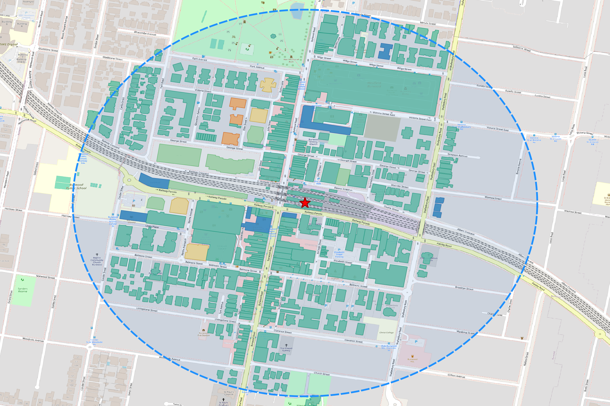

# 🏙️ WebBaseGISVisualization

## Burwood Station 3D 건물 시각화 프로젝트

> 호주 시드니 Burwood Station 주변 건물 513개를 3D로 볼 수 있는 프로젝트입니다.
> 마우스로 돌리고, 확대하고, 건물 위에 올리면 이름과 높이가 나와요!



---

## 📖 이 프로젝트가 뭐예요?

**지도 위에 건물을 레고처럼 세워서 3D로 보여주는 프로그램**이에요.

- 🗺️ 인터넷 지도(OpenStreetMap)에서 건물 데이터를 가져와요
- 🏢 건물마다 높이가 다르니까, 높이만큼 위로 쏙쏙 올려서 보여줘요
- 🎨 낮은 건물은 파란색, 높은 건물은 빨간색으로 칠해요
- 🖱️ 마우스로 빙글빙글 돌려볼 수 있어요!

---

## 🧒 10살도 이해하는 설명

### 이 프로젝트를 레고에 비유하면...

```
1️⃣ 레고 조각 가져오기
   → 인터넷 지도에서 건물 모양을 다운로드해요
   → "이 건물은 3층이고, 저 건물은 10층이야!" 하는 정보도 같이 가져와요

2️⃣ 레고 판 위에 올려놓기
   → QGIS라는 지도 프로그램에 건물들을 올려놓아요
   → 배경에는 진짜 지도가 깔려있어요 (길, 공원, 가게 다 보여요!)

3️⃣ 레고에 색칠하기
   → 낮은 건물(1~2층) = 파란색 🔵
   → 중간 건물(4~7층) = 하늘색 🩵
   → 높은 건물(12층+) = 주황색 🟠
   → 아주 높은 건물(20층+) = 빨간색 🔴

4️⃣ 3D로 세우기
   → 납작한 건물 모양을 높이만큼 위로 쭉 올려요
   → 마치 종이를 접어서 상자를 만드는 것처럼!

5️⃣ 빙글빙글 돌려보기
   → 웹 브라우저(크롬, 사파리)에서 마우스로 돌려볼 수 있어요
   → 확대도 되고, 기울이기도 돼요!
```

### 왜 만들었어요?

> "이 동네에 높은 건물이 많을까? 낮은 건물이 많을까?"
>
> 이런 궁금증을 **눈으로 바로 확인**할 수 있게 해주는 거예요!
> 도시를 계획하는 사람, 건축가, 그리고 지도가 궁금한 누구나 쓸 수 있어요.

---

## 🚀 실행 방법

### 준비물

| 준비물 | 설명 |
|--------|------|
| **Python 3** | 컴퓨터에 이미 설치되어 있을 거예요 |
| **웹 브라우저** | Chrome, Safari, Firefox 아무거나! |
| **인터넷** | 배경 지도를 불러오려면 필요해요 |

### 3D 웹 뷰어만 보고 싶다면 (가장 쉬운 방법!)

```bash
# 1. 이 폴더로 이동
cd /path/to/WebBaseGISVisualization

# 2. 웹 서버 켜기 (파이썬이 해줘요!)
python3 -m http.server 8080 --bind 127.0.0.1 &

# 3. 브라우저에서 열기
open http://localhost:8080/burwood_3d_viewer.html
```

> 💡 **쉽게 말하면**: 2번에서 작은 서버를 켜고, 3번에서 브라우저가 열려요. 끝!

### QGIS 프로젝트도 함께 만들고 싶다면

```bash
# QGIS + MCP 플러그인이 설치되어 있어야 해요
python3 run_all_steps.py
```

> 이 명령 하나로 QGIS가 켜지고, 지도가 만들어지고, 파일이 저장돼요!

---

## 🖱️ 3D 뷰어 조작법

| 동작 | 방법 | 비유 |
|------|------|------|
| **이동** | 왼쪽 버튼 + 드래그 | 지도를 손으로 밀어서 옮기기 |
| **회전** | 오른쪽 버튼 + 드래그 | 지구본을 손으로 돌리기 |
| **확대/축소** | 마우스 휠 스크롤 | 돋보기로 가까이/멀리 보기 |
| **기울기** | Ctrl + 드래그 | 하늘에서 보다가 옆에서 보기 |
| **건물 정보** | 건물 위에 마우스 올리기 | 건물에 마우스 대면 이름표가 나와요! |

---

## 🏢 건물 높이별 색상 안내

| 색상 | 높이 | 층수 | 비유 |
|------|------|------|------|
| 🔵 **진한 파랑** | 0~6m | 1~2층 | 우리 집 같은 작은 건물 |
| 🩵 **연한 파랑** | 6~12m | 2~4층 | 동네 가게, 작은 빌딩 |
| 🤍 **하늘색** | 12~20m | 4~7층 | 학교, 아파트 |
| 🟡 **연한 주황** | 20~35m | 7~12층 | 큰 아파트, 오피스텔 |
| 🟠 **주황색** | 35~60m | 12~20층 | 높은 오피스 빌딩 |
| 🔴 **빨간색** | 60m+ | 20층 이상 | 아주 높은 타워! |

---

## 📂 파일 구조

```
WebBaseGISVisualization/
│
│  ✨ 핵심 파일 (이것만 알면 돼요!)
├── burwood_3d_viewer.html    ← 🌐 3D 웹 뷰어 (브라우저에서 열어요)
├── burwood_buildings.geojson ← 🏢 건물 데이터 (513개 건물 정보)
├── run_all_steps.py          ← 🚀 전체 자동화 (한 줄로 다 실행!)
│
│  📸 결과물
├── burwood_2d_map.png        ← 2D 지도 이미지
├── burwood_3d.qgz            ← QGIS 프로젝트 파일
│
│  🔧 QGIS 자동화 스크립트 (Step 1~5)
├── burwood_3d_step1_setup.py     ← 프로젝트 초기 설정
├── burwood_3d_step2_buildings.py ← 건물 데이터 다운로드
├── burwood_3d_step3_style.py     ← 색칠하기 (높이별 색상)
├── burwood_3d_step4_3dview.py    ← 3D 설정
├── burwood_3d_step5_render.py    ← 사진 찍기 & 저장
├── auto_start_mcp.py             ← QGIS 자동 시작 도우미
│
│  📖 개발 문서
├── dev_docs/
│   ├── PRD.md              ← 제품 요구사항
│   ├── CRM.md              ← 고객 요구사항
│   ├── MVP.md              ← 최소 기능 제품 정의
│   └── BUILD_PROCESS.md    ← 구축 과정 상세 설명
│
├── CLAUDE.md               ← AI 개발 도우미 가이드
└── README.md               ← 📍 지금 읽고 있는 이 파일!
```

---

## 🔧 어떻게 만들어졌어요? (기술 설명)

### 간단 버전 (10살용)

```
🌍 인터넷 지도에서 건물 정보를 가져왔어요
    ↓
🗺️ QGIS라는 지도 프로그램에서 예쁘게 꾸몄어요
    ↓
🌐 웹 브라우저에서 3D로 볼 수 있게 만들었어요!
```

### 자세한 버전 (어른용)

```
📡 1단계: 데이터 수집
   OpenStreetMap의 Overpass API로
   Burwood Station 반경 500m 내 건물 폴리곤 + 높이 데이터 수집
   → burwood_buildings.geojson (513개 건물, 221KB)

🗺️ 2단계: QGIS 프로젝트 자동 구성
   Python 스크립트가 TCP 소켓(MCP 서버)을 통해
   QGIS에 명령을 보내서 자동으로 레이어 구성 + 스타일링 + 렌더링
   → burwood_2d_map.png + burwood_3d.qgz

🌐 3단계: 웹 3D 시각화
   deck.gl(3D 렌더링) + MapLibre(배경지도) 라이브러리로
   GeoJSON 건물 데이터를 높이만큼 돌출시켜 인터랙티브 3D 구현
   → burwood_3d_viewer.html
```

---

## 🛠️ 사용된 기술

| 기술 | 하는 일 | 비유 |
|------|---------|------|
| **OpenStreetMap** | 건물 데이터 제공 | 세계 최대 무료 지도 백과사전 |
| **QGIS** | 지도 프로젝트 제작 | 전문가용 지도 그리기 프로그램 |
| **Python** | 모든 걸 자동으로 연결 | 로봇 팔 (이것저것 자동으로 해줘요) |
| **deck.gl** | 3D 건물 렌더링 | 레고를 3D로 조립해주는 도구 |
| **MapLibre** | 배경 지도 표시 | 지도 벽지 (건물 뒤에 깔리는 지도) |
| **MCP 서버** | Python ↔ QGIS 통신 | 전화기 (두 프로그램이 대화하는 통로) |

---

## ❓ 자주 묻는 질문

### Q: QGIS 없이도 3D를 볼 수 있나요?
**A: 네!** `burwood_3d_viewer.html`은 웹 브라우저만 있으면 돼요. QGIS는 필요 없어요.

### Q: 다른 동네도 볼 수 있나요?
**A:** 현재는 Burwood Station만 지원해요. 향후 좌표를 입력하면 아무 동네나 볼 수 있도록 업데이트할 예정이에요.

### Q: 인터넷 없이도 되나요?
**A:** 건물 데이터(GeoJSON)는 이미 파일로 있어서 괜찮지만, 배경 지도와 deck.gl 라이브러리를 불러오려면 인터넷이 필요해요.

### Q: 맥(Mac)에서만 되나요?
**A:** 3D 웹 뷰어는 **모든 운영체제**(Windows, Mac, Linux)에서 작동해요! QGIS 자동화 스크립트만 현재 Mac 경로로 되어 있어요.

---

## 📜 라이선스

- 건물 데이터: [OpenStreetMap](https://www.openstreetmap.org/copyright) (ODbL)
- 배경 지도 타일: [CARTO](https://carto.com/) (CC BY 3.0)
- 프로젝트 코드: MIT License
